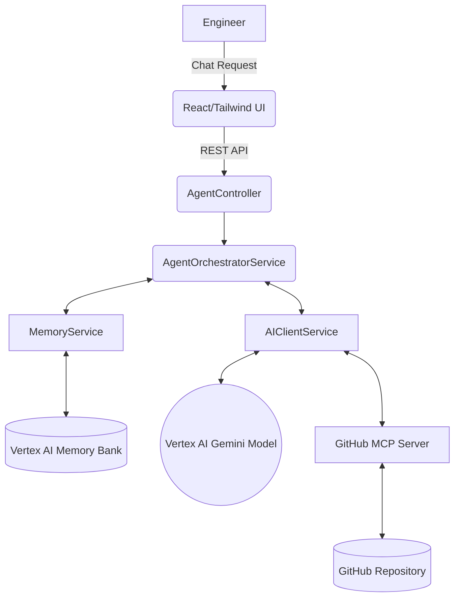

# 🧠 RecallOps AI

[](https://jdk.java.net/25/)
[](https://spring.io/projects/spring-boot)
[](https://react.dev/)
[](https://cloud.google.com/vertex-ai)
[](https://opensource.org/licenses/MIT)

> A prototype Engineering Memory Agent exploring persistent engineering context, incident intelligence, and memory-aware debugging workflows.

---

## 1. Project Overview
**RecallOps AI** is an advanced engineering assistant designed to break down the silos of historical technical knowledge. It orchestrates interactions between a Large Language Model (Vertex AI Gemini), real-time repository data (via GitHub Model Context Protocol), and long-term session memory. This enables engineers to query past incidents, debug complex architectures, and scale systems without losing conversational context.

## 2. Problem Statement
Engineering teams lose hundreds of hours retracing steps during incidents or deep-dive debugging sessions. Critical context is often scattered across fragmented post-mortems (`incidents/`), debugging logs (`debugging/`), and architectural decisions (`kt-sessions/`). Traditional AI agents lack the "memory" to recall what was discussed 10 minutes ago, forcing engineers to repeatedly rebuild context.

## 3. Why Engineering Memory Matters
An AI agent without memory is just a search engine. Engineering requires **contextual continuation**. If an engineer asks about a database timeout, and then follows up with "how do we fix that?", the agent must recall the exact incident and the specifics of the connection pool configuration. 

RecallOps AI implements a **Memory-First** approach:
1. It remembers the precise technical facts discussed in the current session.
2. It intelligently decides when to query the repository vs. when to rely on its persistent memory bank, drastically reducing I/O latency.

## 4. Features
- **Intelligent Dynamic Discovery:** Proactively scans logical documentation domains (`incidents/`, `debugging/`, `kt-sessions/`) without needing hardcoded paths.
- **Memory-First Orchestration:** Prioritizes session history for follow-up questions, dropping latency to under 2 seconds.
- **Parallel Tool Execution:** Utilizes Java `CompletableFuture` and Virtual Threads to simultaneously fetch multiple repository files via the GitHub MCP, cutting retrieval time by 4x.
- **Hybrid Knowledge Fallback:** If specific internal documentation is missing, the agent falls back to providing general engineering best practices.
- **Truthful Trace Logging:** UI explicitly shows the reasoning flow, distinguishing between live GitHub reads and memory retrievals.
- **Markdown & Code Block Support:** Beautiful, typography-enhanced UI for rendering complex engineering summaries and code snippets.

## 5. Architecture



## 6. ADK + MCP + Memory Bank Concepts
- **ADK (Agentic Design Kit) Style Orchestration:** Separates reasoning from execution. The orchestrator plans the necessary data retrievals before interacting with the LLM.
- **MCP (Model Context Protocol):** Standardizes how the AI agent reads from GitHub. We use `get_file_contents` to surgically extract markdown documentation.
- **Vertex AI Memory Bank:** Persistent, cloud-native storage for session histories. By binding conversational context to a `Reasoning Engine ID`, the agent can recall past interactions across UI reloads.

## 7. Demo Workflow
1. **Initialize Session:** Engineer asks: *"What issues did we have with synchronized blocks?"*
2. **Parallel Retrieval:** The agent identifies the `debugging/` taxonomy and spawns virtual threads to fetch `vthread-pinning-learning.md`.
3. **Synthesis:** The agent returns a highly-grounded technical summary.
4. **Follow-up:** Engineer asks: *"How did we resolve it?"*
5. **Memory-First:** The agent skips the MCP tool calls, retrieves the context from the Vertex AI Memory Bank, and answers instantly.

## 8. Screenshots
*(Add screenshots of the UI, Agentic Reasoning panel, and Terminal logs here)*
- `screenshots/workspace-view.png`
- `screenshots/reasoning-trace.png`

## 9. Tech Stack
### Backend
- Java 25 (Virtual Threads Enabled)
- Spring Boot 3.5.x
- Spring AI (Vertex AI Gemini, MCP Client)
- Google Cloud Vertex AI API

### Frontend
- React 19
- TypeScript
- Tailwind CSS (+ Typography Plugin)
- Axios & Framer Motion

### Infrastructure
- Google Cloud Run (4 CPU, 4Gi Memory)
- Google Artifact Registry
- Google Secret Manager

## 10. Local Setup

### Prerequisites
- JDK 25
- Node.js & npm (for MCP server)
- Google Cloud CLI authenticated

### Backend
```bash
cd backend
export GOOGLE_CLOUD_PROJECT="your-project-id"
export GOOGLE_CLOUD_LOCATION="us-central1"
export GITHUB_TOKEN="your-github-pat"
export REASONING_ENGINE_ID="your-vertex-reasoning-id"

mvn spring-boot:run
```

### Frontend
```bash
cd frontend
npm install
npm start
```

## 11. Cloud Run Deployment
We utilize a modular bash script to handle artifact generation, secret binding, and service deployment.

```bash
# Full Deployment (Backend + Frontend)
chmod +x deploy.sh
./deploy.sh

# Frontend-Only Deployment
chmod +x deploy-frontend.sh
./deploy-frontend.sh
```

## 12. Future Improvements
- **Semantic Search/RAG Integration:** Moving beyond exact file paths to vector-based document retrieval for massive repositories.
- **Project Loom StructuredTaskScope:** Fully migrating to `StructuredTaskScope` once the preview API stabilizes in newer JDK releases.
- **Multi-Repo Context:** Allowing the MCP server to dynamically switch between different organizational repositories.

## 13. Current MVP Limitations
- **Token Limits:** Extremely large files might exceed the context window of the currently configured Gemini model.
- **Rate Limiting:** High-frequency, multi-file queries can trigger Google Cloud `RESOURCE_EXHAUSTED` (429) errors, mitigated currently via Spring Retry backoffs.
- **Stateless MCP:** The current GitHub MCP server fetches files anew on each tool call without local caching.
